## ALL-IN SHOP
*Group:* ***CSSE-1804K*** 

*Student:* ***Nurgazy Ermahan***

*Discepline:* ***Java EE***

## Introduction
Project "ALL E-SHOP" - online store selling electronics. The project was made within the course. The project includes all the logic of a standard online store.

## Screenshots
- Main page
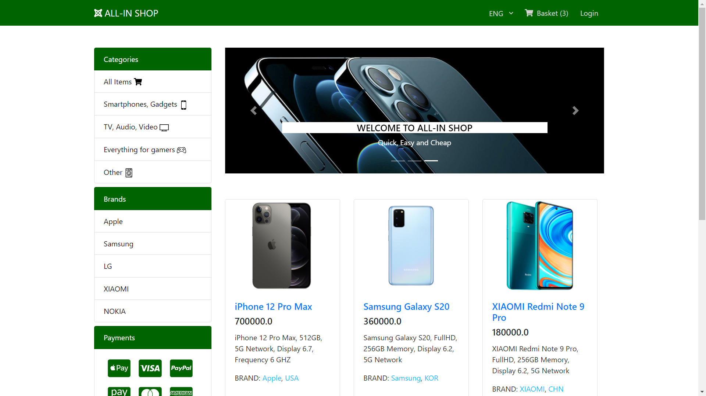
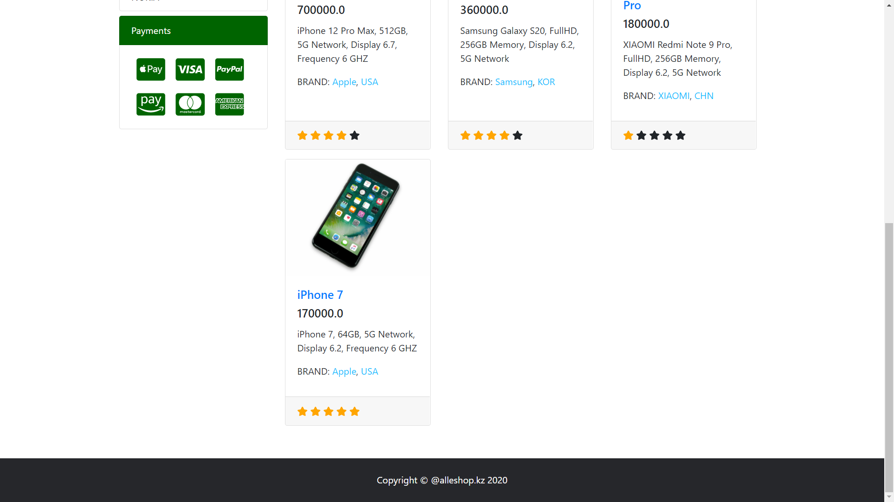
- Details ShopItem page
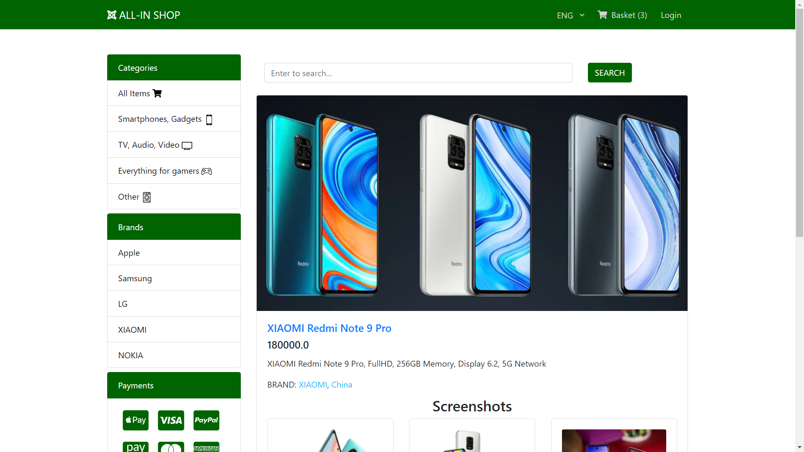
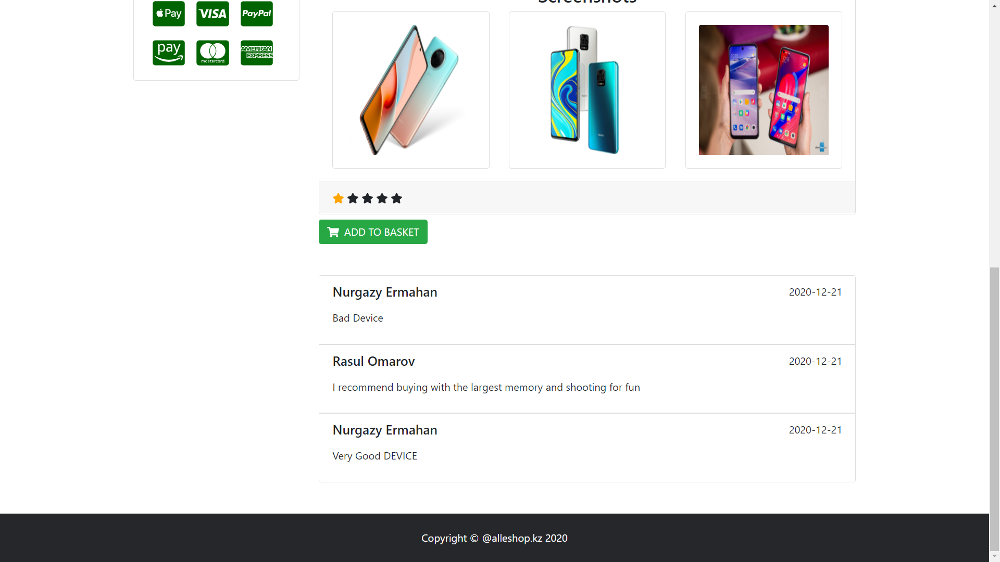
- Login page
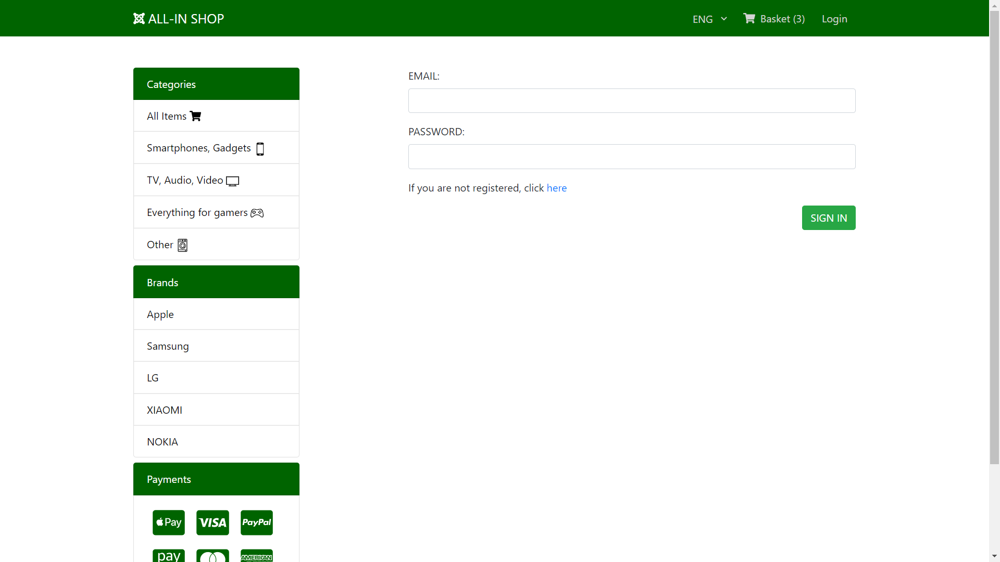
- Register page
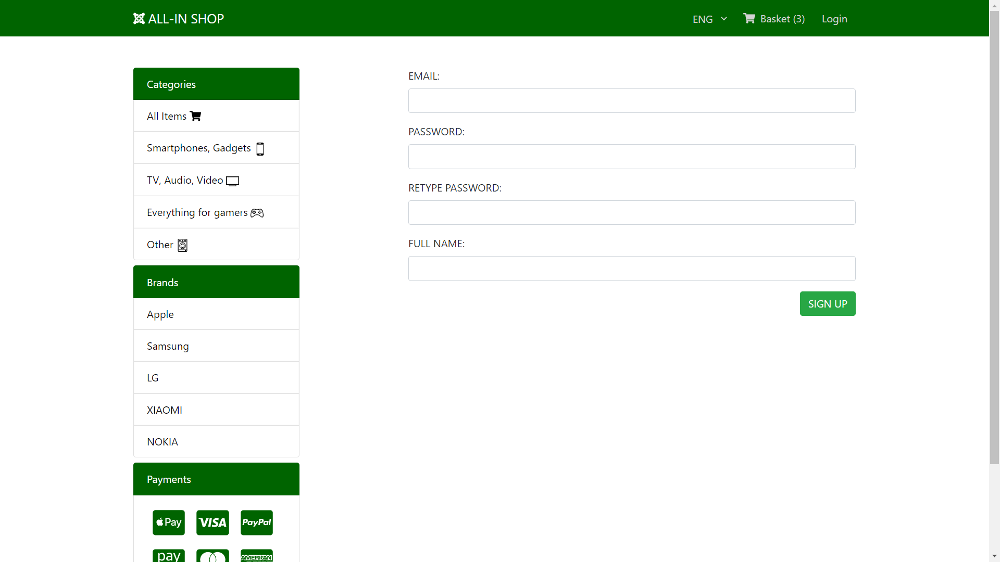
- Search page
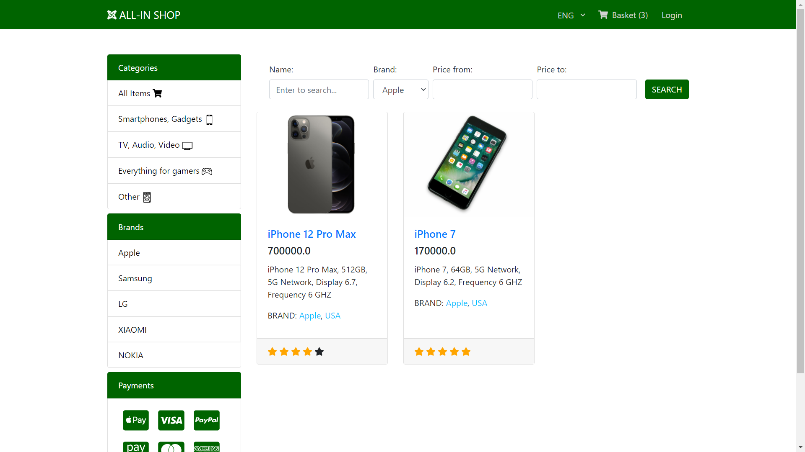
- Profile page
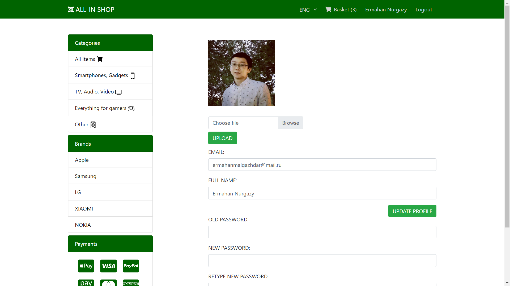
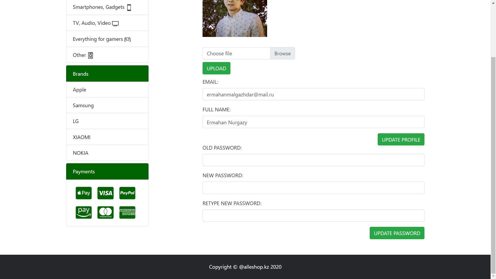
- Basket page
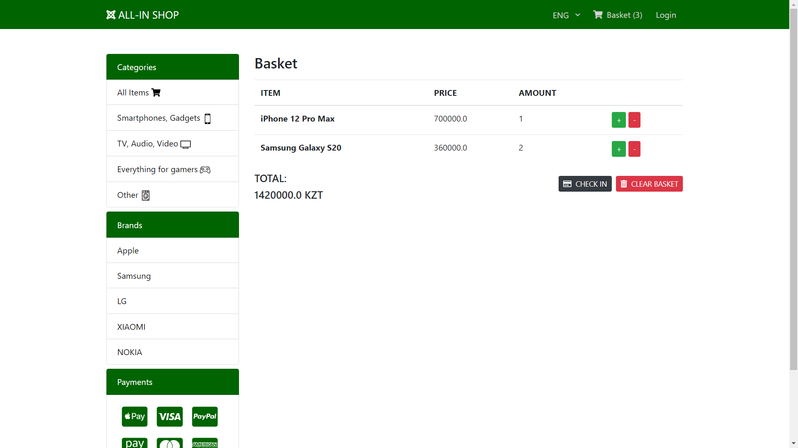
- Admin page
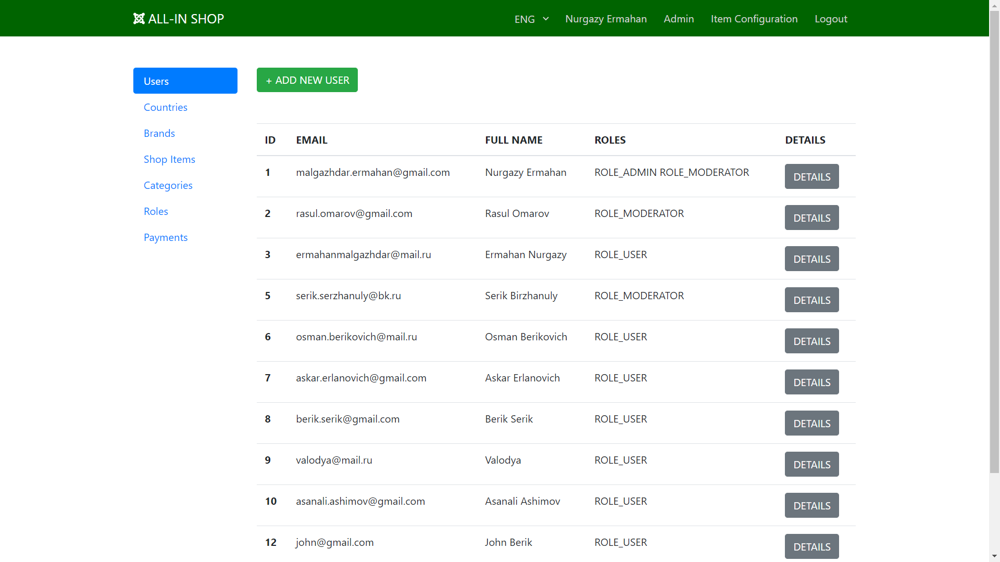
- Moderator page

